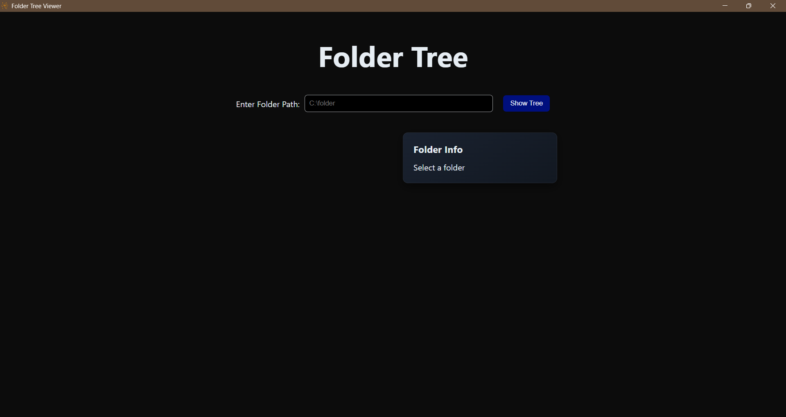
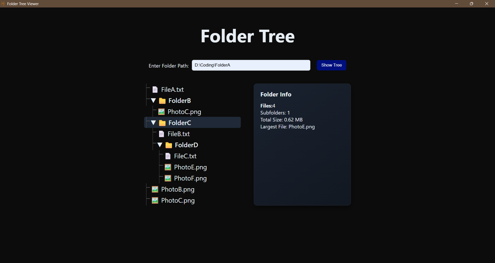

# Folder Tree Viewer

A lightweight desktop application built with NeutralinoJS that visualizes directory structures as an interactive expandable tree and shows their contents with size.

The application recursively scans folders, renders the hierarchy dynamically, and provides detailed folder statistics including total size, number of files, subfolders, and largest file.

Designed as a minimal and efficient desktop tool without heavy runtimes.

## Preview

### Main Interface

### Folder Analysis Example

## Features
- Recursive folder tree rendering
- Expandable and collapsible directories
- Folder statistics analysis
- Displays:
  - Total files
  - Subfolders
  - Total folder size
  - Largest file
- File type detection (images vs regular files)
- Interactive UI with hover effects
- Lightweight desktop application

- ## How It Works
1. The user enters a directory path.
2. NeutralinoJS filesystem APIs read the directory contents.
3. The application recursively scans subdirectories.
4. A dynamic tree structure is rendered in the UI.
5. Clicking a folder triggers a recursive analysis to compute:
   - file count
   - subfolder count
   - total size
   - largest file
6. The results are displayed in the Folder Info panel.

## Installation
Clone the repository:
git clone https://github.com/YOUR_USERNAME/folder-tree-viewer.git
Navigate to the project directory:
cd folder-tree-viewer

## Run the Application
Install Neutralino CLI:
npm install -g @neutralinojs/neu
Run the project:
neu run

## Tech Stack
- NeutralinoJS
- JavaScript
- HTML
- CSS

- ## Project Structure

folder-tree-viewer
│
├ resources
│   ├ index.html
│   ├ styles.css
│   └ js
│       └ main.js
│
├ assets
│   ├ ui.png
│   └ tree.png
│
├ neutralino.config.json
└ README.md
